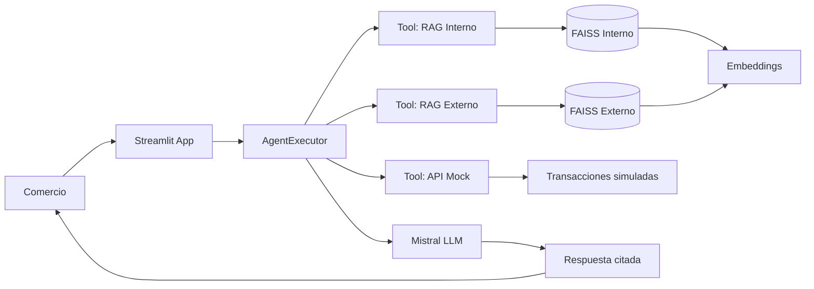

# Arquitectura de la solución — IE4

## Componentes

| Módulo | Responsabilidad |
|---|---|
| `src/ingest.py` | Carga, chunking, indexación FAISS |
| `src/rag.py` | Recuperación con scores y citas |
| `src/agent.py` | Agente LangChain + herramientas |
| `src/api_mock.py` | Consulta de transacciones |
| `src/app.py` | Interfaz de demostración |
| `scripts/build_index.py` | Construcción de índices |
| `scripts/run_agent.py` | CLI de prueba |

## Decisiones técnicas (IE8)
- **LangChain:** Orquestación de agente y tools (patrón del curso RA2).
- **FAISS:** Búsqueda vectorial eficiente en prototipo académico.
- **Dos índices separados:** Diferencia corpus interno vs normativo externo.
- **API mock:** Simula integración operacional sin sistemas reales.
- **Streamlit:** Evidencia visual para presentación y defensa.
