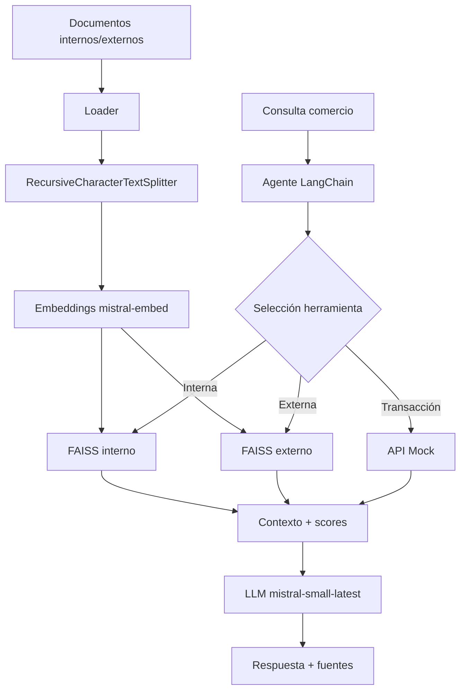

# Pipeline RAG — IE3

## Flujo de información

## Fuentes de datos

| Tipo | Archivos | Uso |
|---|---|---|
| Interno | manual, políticas, FAQ, tickets | Operativo/comercial |
| Externo | CMF, Ley 19.628, PCI-DSS | Normativo |

## Parámetros
- Chunk size: 350
- Overlap: 50
- Top-k: 3
- Vector store: FAISS (persistido en `storage/`)

## Integración interna + externa
El agente decide qué índice consultar según la naturaleza de la pregunta, cumpliendo IL1.2 del curso.
